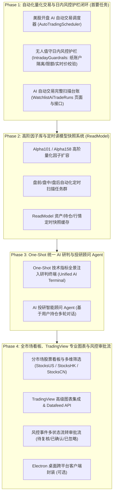

# longbridge-platform-core 深度重构与功能拆解接入完整计划清单

本文档基于对原平台 **`longbridge-platform-core`** 与当前重构平台 **`smart-finance-platform`**（RuoYi-FastAPI + Vue3）的全代码库对比，梳理出所有缺失及待深化的业务子系统、算法引擎、接口与前端工作台，并按微模块进行详细拆解。

> **特别说明（依用户要求定制）**：
> - 券商通道**专注长桥证券（Longbridge OpenAPI）**，无需引入老虎证券。
> - **无需 Capacitor 移动端原生工程**，平台专注 Web 响应式终端与可选的 Electron 桌面客户端。
> - 计划已分阶段编排，下次开机时可直接从 **Phase 1（自动化交易与日内风控护栏闭环）** 立即开工。

---

## 📊 一、两代平台整体架构与能力差异矩阵

| 业务子系统 / 核心能力 | 原平台 (`longbridge-platform-core`) | 当前平台 (`smart-finance-platform`) | 重构接入策略（纯长桥 + Web/桌面） |
| :--- | :--- | :--- | :--- |
| **券商通道** | 长桥 OpenAPI 深度接入 | 长桥 OpenAPI 基础接入 | **[深化]** 长桥 Context 单例复用、盘中实时价秒级刷新、订单生命周期深度同步 |
| **自动化交易闭环** | 盘前/盘中/盘后定时扫描 + 自动下单 + 日内多重风控护栏 | 仅支持手动下单与简单信号查询 | **[核心待接入]** 落地自动化交易执行器、日内护栏与自选池开盘自动扫描 |
| **扫描台账追踪** | `WatchlistAiTradeRuns` 全字段记录（跳过原因、候选快照、执行明细） | 基础批次列表 | **[待完善]** 升级全维度扫描与执行决策历史复盘台账（含候选/机会/跳过原因快照） |
| **量化因子库** | 8大基础因子族 + 1000+ 高阶因子（WorldQuant Alpha101 / Qlib Alpha158） | 8大基础因子族（50+指标） | **[待扩容]** 引入 Alpha101/158 高阶量化因子库与 Alphalens 提纯 |
| **定时扫描与快照** | 每日全量因子收盘计算 + 资产/持仓/行情定时快照（ReadModel Snapshots） | 仅在被请求时计算 | **[待构建]** 构建定时 ReadModel 快照调度，大幅提升首屏加载性能 |
| **AI 投研与 Agent** | One-Shot 统一全景研判 + NVIDIA NIM + 投研顾问 Agent | 基础单标的研判与模型对话 | **[待升级]** 接入全量技术指标 One-Shot 注入与投研 Agent 对话 |
| **市场中心与股票池** | US / HK / CN 分市场全量数据 + 板块异动 + 行业资金流 | 预置目标标的池 | **[待补充]** 扩展全市场多维度股票筛选、板块联动看板 |
| **专业行情图表** | ECharts + TradingView 专业版集成与自定义 Datafeed | 仅有 ECharts 基础图表 | **[待引入]** 接入 TradingView 高级图表工作台与时序数据桥接 |
| **风控事件流转** | 待复核 / 已确认 / 已忽略 / 需复核 / 超期全生命周期 | 基础风控规则与事件记录 | **[待深化]** 完善风控预警多状态人工审批流与通知联动 |
| **桌面端打包** | Electron 桌面客户端封装 | 仅 Web 运行环境 | **[可选]** 补齐 Electron 桌面客户端壳工程 |

---

## 🛠️ 二、4 大核心阶段实施路线图

---

### 📌 阶段一：自动化量化交易与日内风控护栏闭环（下次开机首推）

- [ ] **1.1 数据实体与 DAO 层落地**
  - 新建 `plat_auto_trade_decision`（自动交易意图与执行明细）
  - 新建 `plat_ai_trade_run_log`（自选股 AI 自动交易全景扫描台账）
  - 在 `trade_dao.py` 中编写标准异步 CRUD。
- [ ] **1.2 日内无人值守风控护栏 (`IntradayGuardrails`)**
  - **纸账户/模拟盘强制隔离**：硬开关控制，防止自动交易误触真实资金；
  - **日内最多订单数限制**（如每日最多允许 10 笔自动委托）；
  - **日内名义本金上限比例**（如当日自动买入总金额不超过总资产的 30%）；
  - **下单前实时价二次校验**：缺少长桥盘中实时报价时默认跳过，杜绝用历史收盘价盲目下单；
  - **受控卖出保护**：对已有持仓触发卖出信号执行受控平仓。
- [ ] **1.3 美股开盘 AI 自动交易调度器 (`AutoTradingScheduler`)**
  - 在美股交易时段（盘前/盘中/盘后）按用户配置的周期（如每 5 分钟）自动触发自选股池扫描与信号评估，对接 `LongbridgeService.submit_order`。
- [ ] **1.4 自选股 AI 自动交易扫描台账前端 (`WatchlistAiTradeRuns.vue`)**
  - 页面路径：`ruoyi-fastapi-frontend/src/views/trade/ai-runs/index.vue`
  - 完整展示每次扫描的触发来源、扫描标的列表、候选快照、机会标的、实时价刷新状态、跳过原因（如已达仓位上限/无实时价）及最终提交的委托单号。

---

### 📌 阶段二：高阶量化因子库与读模型快照系统 (ReadModel)

- [ ] **2.1 高阶因子库扩容 (`AdvancedFactorEngine`)**
  - 在 `factor_service.py` 基础上扩展引入 **WorldQuant Alpha101** 及 **Microsoft Qlib Alpha158** 经典因子算法。
- [ ] **2.2 盘前/盘中/盘后自动化定时扫描任务群**
  - `DailyMarketScanScheduler`：全市场每日收盘后因子全量计算入库；
  - `PositionMonitorScheduler`：持仓标的异动与止损实时监控；
  - `IndicatorRefreshScheduler`：分时技术指标定时快照生成。
- [ ] **2.3 读模型快照聚合服务 (`ReadModel Snapshot Services`)**
  - 针对资产走势、持仓分布、行情列表建立定时快照缓存，前端首屏直接读取聚合快照，实现毫秒级响应。

---

### 📌 阶段三：One-Shot 统一全景 AI 研判与投研顾问 Agent

- [ ] **3.1 One-Shot 技术指标全景注入 AI 研判 (`Unified AI Terminal`)**
  - 提取标的 8 大因子族与高阶指标特征，以紧凑结构一次性注入大模型，单次请求同时输出趋势打分、风险等级、压力支撑位与操盘建议。
- [ ] **3.2 投研智能顾问 Agent (`AiConsultantService`)**
  - 基于当前用户持仓、自选池及全市场新闻，提供交互式的多轮投研问答（如“分析一下我当前的持仓风险与调仓建议”）。

---

### 📌 阶段四：市场中心深度拓展、TradingView、风控审批流与桌面端

- [ ] **4.1 分市场股票看板与多维筛选 (`StocksUS` / `StocksHK` / `StocksCN`)**
  - 补齐美股、港股、A股分市场的行业板块、涨跌幅榜、成交额榜、PE/PB 估值筛选。
- [ ] **4.2 TradingView 高级图表工作台集成**
  - 在前端集成 TradingView Charting Library，并在后端实现标准的 `Datafeed API`（提供 History K 线与实时 WebSocket Tick 推送）。
- [ ] **4.3 风控事件审批流与多状态流转**
  - 支持对风控触发事件进行“待复核、已确认、已忽略、需复核、超期”的状态变更与处理备注。
- [ ] **4.4 Electron 桌面跨平台客户端打包（可选）**
  - 引入 Electron 配置，支持生成 Windows / macOS 独立客户端。

---

## 🎯 下次开机执行指南

下次开机唤醒后，您只需发送一条简单的指令，例如：
> **“继续从 Phase 1 开始做”**

我将自动从 **Phase 1** 开始，为您按部就班地落地自动交易调度器、日内无人值守护栏、长桥实时价校验以及完整的 `WatchlistAiTradeRuns` 扫描台账闭环！
