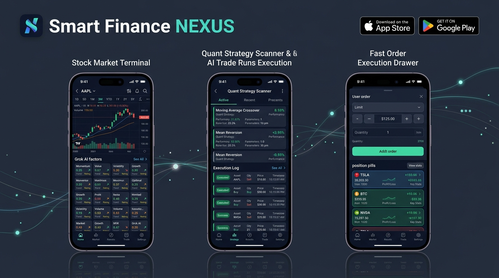
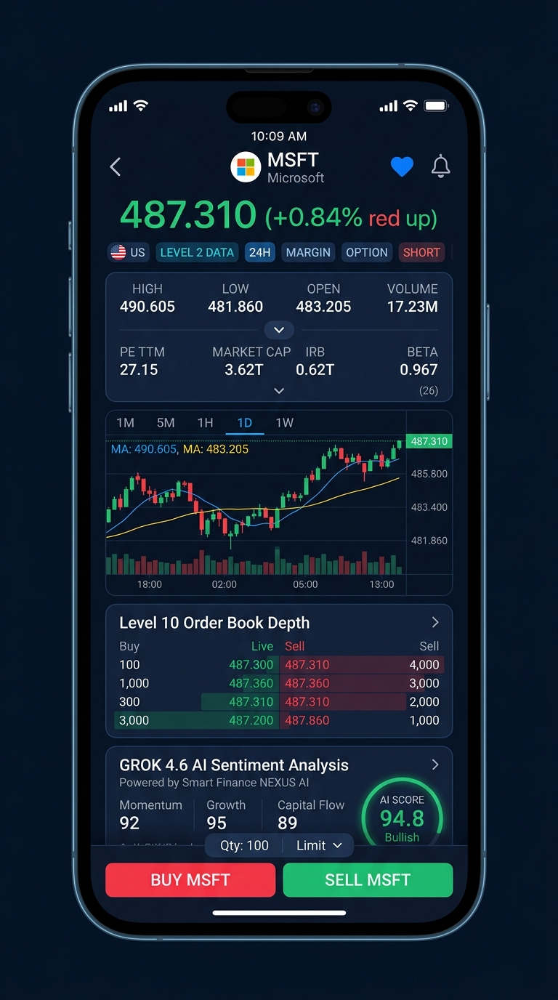
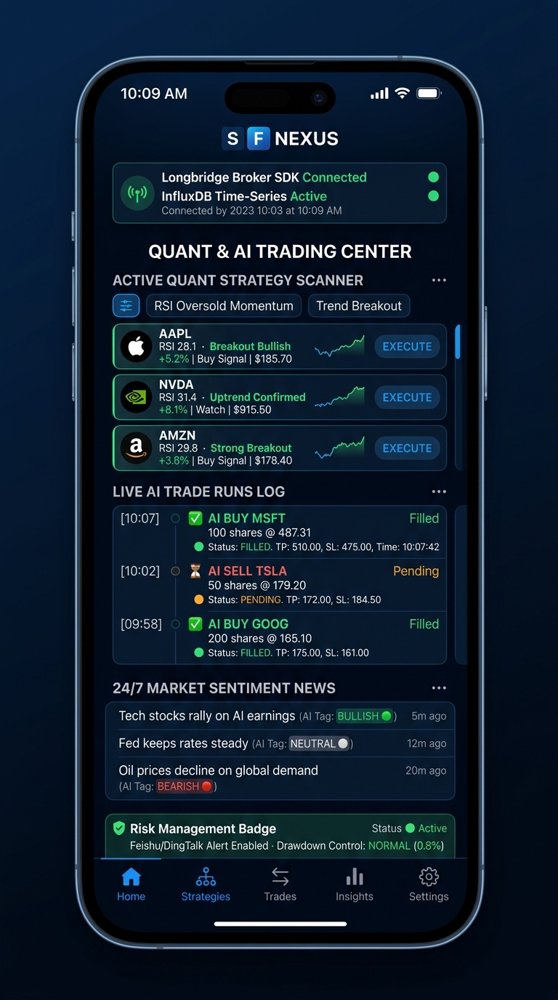
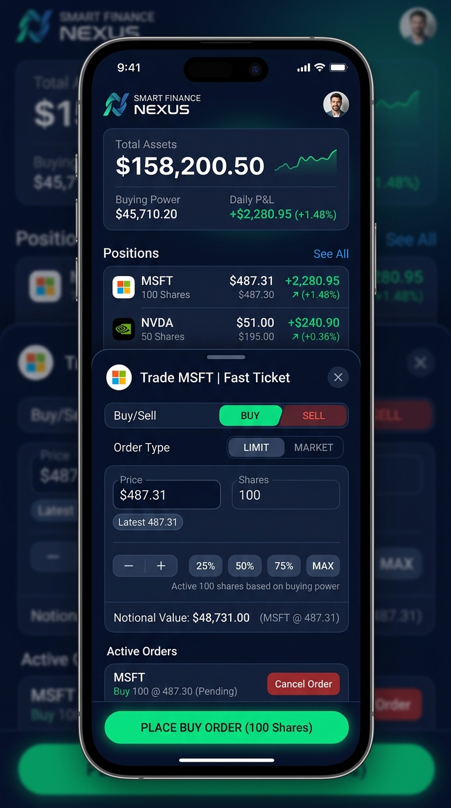
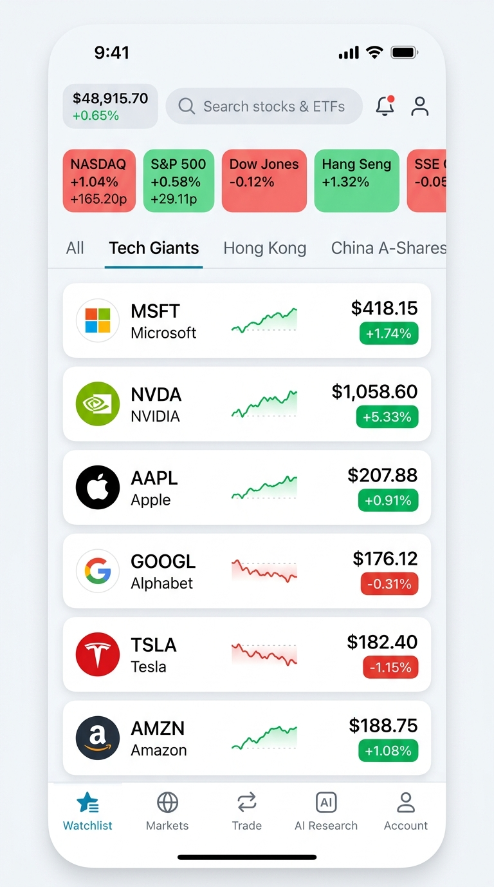
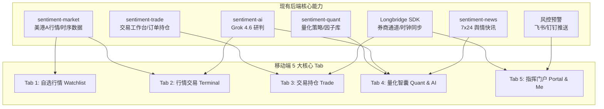

# 智慧金融 · NEXUS 移动端反重力设计稿 (iOS & Android)

> **版本**：v1.0.0 · **体系**：Antigravity Design System · **支持平台**：iOS (iPhone / iPad) & Android (手机 / 折叠屏)  
> **定位**：量化交易与 AI 研判综合移动指挥终端（QUANT · SENTIMENT · MARKET）

---

## 🎨 一、高保真移动端设计图鉴 (谷歌顶级生图模型输出)

### 0. 移动端产品全景设计大图 (iOS & Android 全景三屏联览)

---

### 1. 个股行情与 AI 深度研判终端 (Dark Cyber 墨蓝模式)

### 2. 量化策略雷达与 AI 交易自动执行台账中心

### 3. 极速交易下单抽屉与持仓资产联动 (Bottom Sheet 抽屉)

### 4. 自选盯盘与全景行情首页 (Light Mode 清爽浅色模式)

---

## 🏛️ 二、现有业务系统功能与移动端架构映射

移动端 APP 并非通用股票工具，而是**深度融合智慧金融平台现有全部微服务与业务资产**的移动化延伸：

### 业务模块映射对照表

| 现有系统功能模块 (Web端) | 现有核心路径 / 微服务 | 移动端功能设计与交互呈现 (App端) |
| :--- | :--- | :--- |
| **行情交易终端** | `/trade/terminal` `sentiment-market` | **【行情终端 Tab】**：实时大字报价、26项双列深度财务指标（支持原位折叠/展开）、全周期图表（分时/K线/多指标）、十档深度、逐笔明细、底部常驻买卖栏 |
| **AI 智能研判** | `/ai/chat`, `/ai/model` `sentiment-ai (Grok 4.6)` | **【AI 智囊模块】**：Grok 4.6 实时多因子雷达打分（动量/成长/情绪/质量/资金/预期等）、多空研判观点卡片、AI 标的问答 |
| **交易工作台 & 交易台** | `/trade/desk`, `/trade/trading` `sentiment-trade` | **【极速交易抽屉】**：自底向上半屏呼出，限价/市价单、盘口最新价一键填入、25%/50%/75%/全仓快捷比例、名义金额与购买力即时联动计算 |
| **持仓 & 订单中心** | `/trade/positions`, `/trade/orders` `sentiment-trade` | **【资产与持仓 Tab】**：总资产、可用现金、持仓市值、当日盈亏、持仓列表（浮动盈亏）、当日委托与一键撤单 |
| **量化策略 & 扫描台账** | `/quant/strategy`, `/quant/scan-runs` `sentiment-quant` | **【量化雷达模块】**：RSI 超卖/趋势突破策略实时扫描、量化选股池每日推荐、一键按策略生成订单 |
| **AI 交易台账** | `/trade/ai-runs` `sentiment-trade` | **【AI 执行台账】**：AI 自动化策略执行历史、止盈目标价 (TP) 与止损线 (SL) 动态追踪、成交回报明细 |
| **舆情热度 & 资讯流** | `/sentiment/news`, `/market/heat` `sentiment-news` | **【7x24 舆情快讯】**：全市场 7x24 实时财经简报、AI 利多/利空/中性情绪打标 |
| **长桥券商接入 & 风控** | `/trade/broker`, `/trade/feishu-push` `Longbridge SDK & InfluxDB` | **【风控与券商状态】**：长桥 SDK 活跃连接监控、时序数据通道、飞书/钉钉风控回撤预警推送 |

---

## 📱 三、核心界面详细设计规范

### 1. 【个股行情与 AI 深度研判终端】
- **标的头部导航**：
  - 左侧返回箭头，中间标的代码大字（`MSFT`）+ 中文简称（`微软`），右侧收藏红心、预警铃铛、横竖屏旋转按键；
  - 实时报价看板：超大字号 `487.310 (+0.84% ↑)`，跳动红绿高对比度闪烁；
  - 业务徽章流：`[🇺🇸]` `[⚡2 数据]` `[24H 全时段]` `[融]` `[期]` `[沽]`；
- **26 项深度财务指标（反重力原位折叠/展开机制）**：
  - **默认精简状态（3 行 6 项核心）**：最高 `490.605`、最低 `481.860`、今开 `483.205`、昨收 `483.240`、成交量 `1723.08万`、成交额 `84亿`；
  - **展开状态（点击底部居中 `∨` 箭头）**：原地平滑撑开全部 14 行（26 项）指标：市值、总股本、流通值、PE(TTM/静/动)、PB、委比/量比、股息TTM/率、52周高低、历史高低、均价、振幅、换手率、每手、Beta；**无内部滚动条，滚动仅限右侧/整页**；
- **全周期专业触控图表**：
  - 周期：分时、5日、日K、周K、月K、5分K；
  - 指标：MA均线（5/10/20）、BOLL、VOL量、MACD、KDJ、RSI、主力资金博弈；
  - 触控：双指横向缩放、单指长按十字光标 HUD 浮窗、一键旋转全屏横屏 K 线；
- **盘口十档深度 & 逐笔明细**：
  - 买卖十档深度条（绿色买盘 / 红色卖盘比例背景），点击盘口价格直接带入交易抽屉；
- **Grok 4.6 AI 研判卡片**：
  - 实时显示模型综合置信度与打分（如 `94.8分 强烈看多`）；
  - 动量因子 (92)、成长因子 (95)、资金流向 (89) 等 8 维因子评分胶囊；
- **底部常驻交易栏 (Sticky Bottom Bar)**：
  - 红色【买入 MSFT】与绿色【卖出 MSFT】全宽按键，一键呼出极速交易抽屉。

---

### 2. 【量化策略雷达与 AI 交易自动执行台账】
- **基础设施状态看板**：
  - 顶部状态徽章：`Longbridge Broker SDK Connected (已连接)` + `InfluxDB Time-Series Active`；
- **活跃量化策略扫描器 (Active Quant Scanner)**：
  - 策略快速切换：`RSI 超卖反弹`、`趋势突破 (Trend Breakout)`、`主力资金共振`；
  - 扫描命中标的卡片（如 AAPL、NVDA、AMZN），展示触发条件与走势图，右侧带一键【执行/下单 (EXECUTE)】；
- **AI 自动化交易执行台账 (Live AI Trade Runs Log)**：
  - 实时时间轴呈现 AI 策略下单流水（如 `[10:07] AI BUY MSFT 100股 @ 487.31 已成交`）；
  - 动态显示止盈目标价 (TP: 510.00) 与止损线 (SL: 475.00)；
- **7x24 市场舆情快讯流**：
  - 实时快讯聚合，AI 情绪标签：`[利多 / BULLISH 🟢]`、`[中性 / NEUTRAL ⚪]`、`[利空 / BEARISH 🔴]`；
- **风控与推送监控徽标 (Risk Management Badge)**：
  - 飞书/钉钉风控推送通道监控、当前组合最大回撤控制（`NORMAL 0.8%`）。

---

### 3. 【极速交易下单抽屉与持仓资产联动】
- **顶部账户资产卡片**：
  - 总资产（`$158,200.50`）、购买力（`$45,710.20`）、当日盈亏（`+$2,280.95 +1.48%`）；
  - 实时持仓缩略卡（MSFT、NVDA 等持仓股数、现价与浮动盈亏）；
- **极速交易下单抽屉 (Fast Ticket Bottom Sheet)**：
  - 买卖方向切换（Buy / Sell）；
  - 订单类型：限价单 (Limit) / 市价单 (Market)；
  - 委托价格步进器：带 `+` / `-` 微调与【最新价填入 (Latest)】按钮；
  - 委托数量步进器：附带 `25%`、`50%`、`75%`、`全仓 (Max)` 快捷计算胶囊；
  - 名义金额计算：实时联动显示委托总额（`$48,731.00`）与剩余购买力；
  - 当日挂单监控：展示当前活动委托，支持一键快速【撤单 (Cancel Order)】；
  - 底部全宽大按钮：【极速买入/卖出 (100股)】，带触觉震动反馈。

---

## 🎨 四、反重力设计系统规范 (Antigravity Design Tokens)

### 1. 颜色体系 (Color System)

| Token 变量名 | 深色墨蓝终端 (Dark Cyber) | 清爽浅色 (Light Mode) | 作用场景 |
| :--- | :--- | :--- | :--- |
| `--bg-app` | `#0A0E17` (极深墨蓝) | `#F8FAFC` (极浅青灰) | App 全局底色 |
| `--bg-card` | `#141C2B` / `#162032` | `#FFFFFF` (纯白) | 卡片/功能容器底色 |
| `--border-subtle`| `rgba(148, 163, 184, 0.14)` | `#E2E8F0` (柔和浅灰) | 分割线与模块边框 |
| `--text-primary` | `#F8FAFC` (高亮白) | `#0F172A` (深灰黑) | 主标题、核心大字报价 |
| `--text-secondary`| `#94A3B8` (中灰蓝) | `#475569` (石墨灰) | 标的名称、副指标、时间 |
| `--stat-up` | `#F43F5E` / `#DC2626` | `#DC2626` (鲜红) | 上涨高亮色 |
| `--stat-down` | `#10B981` / `#059669` | `#059669` (翠绿) | 下跌高亮色 |
| `--accent-gold` | `#F59E0B` | `#D97706` (琥珀金) | 分时均线、VIP徽章、研判高亮 |

### 2. 触控与排版规范
- **基准网格**：基于 iOS 393×852 (iPhone 15/16 Pro) 与 Android 360×800 弹性栅格；
- **最小触控热区**：所有交互按键与 Tab 高度 $\ge 44\text{pt}$；
- **字体规范**：数字全部启用等宽字体排版 `font-variant-numeric: tabular-nums`，消除价格跳动时的左右抖动；
- **手势动力学**：交易抽屉支持下拉手势回弹、K线长按十字光标带磁性吸附。

---

## 🛠️ 五、跨平台技术实现与工程实施路线

### 1. 推荐技术栈 (Flutter / React Native)
- **跨平台方案**：Flutter (Canvas 级别高性能渲染) 或 React Native + Expo；
- **图表引擎**：移动端原生高帧率 K 线引擎（`kline_flutter` / `react-native-skia`）；
- **数据传输**：WebSocket 实时行情多路复用通道 + RESTful 业务接口（复用现有 FastAPI 后端）；
- **系统特质**：
  - **iOS**：接入灵动岛 (Dynamic Island) 盯盘卡片与锁定屏幕行情实时小组件 (Live Activities)；
  - **Android**：桌面行情监控小部件 (App Widget) 与常驻通知栏行情快照。

### 2. 实施计划步骤
1. **阶段一 (原型验证)**：完成 Flutter / React Native 工程底座搭建，打通 `/auth/login` 与 `/trade/terminal` WebSocket 行情流；
2. **阶段二 (核心功能落地)**：实现个股行情交易终端（含 26 项指标折叠展开与 ECharts/KLine 图表）、极速交易抽屉与持仓联动；
3. **阶段三 (量化与 AI 矩阵集成)**：集成量化策略扫描雷达、AI 交易执行台账、7x24 舆情快讯流与飞书/钉钉风控推送；
4. **阶段四 (多端发布与双平台提审)**：完成 iOS TestFlight 内测与 Android APK 打包上线。
